# Photo gallery

Screenshots and build photos for the CATAN ESP32 Companion Box.

---

## 1. Full breadboard setup

*Whole wiring — ESP32, LCD, buttons, LEDs, buzzer.*

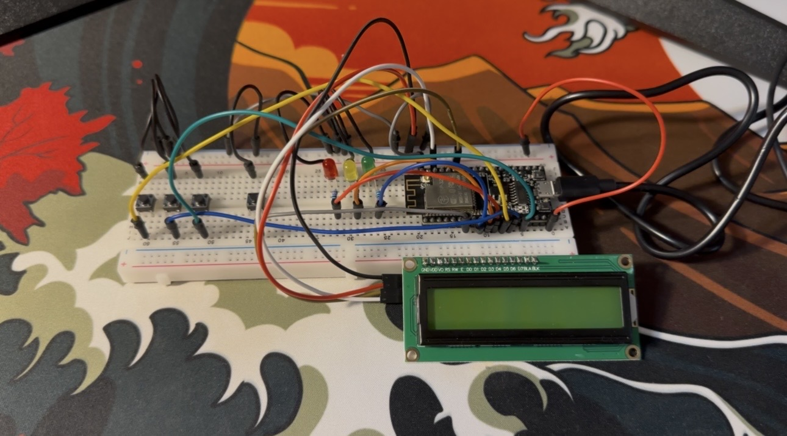

<!-- Paste or save as: docs/photos/00-breadboard-full.jpg -->

---

## 2. Game states

### Starting

*Boot screen: "CATAN Companion" / "Starting..." or "Setup..."*

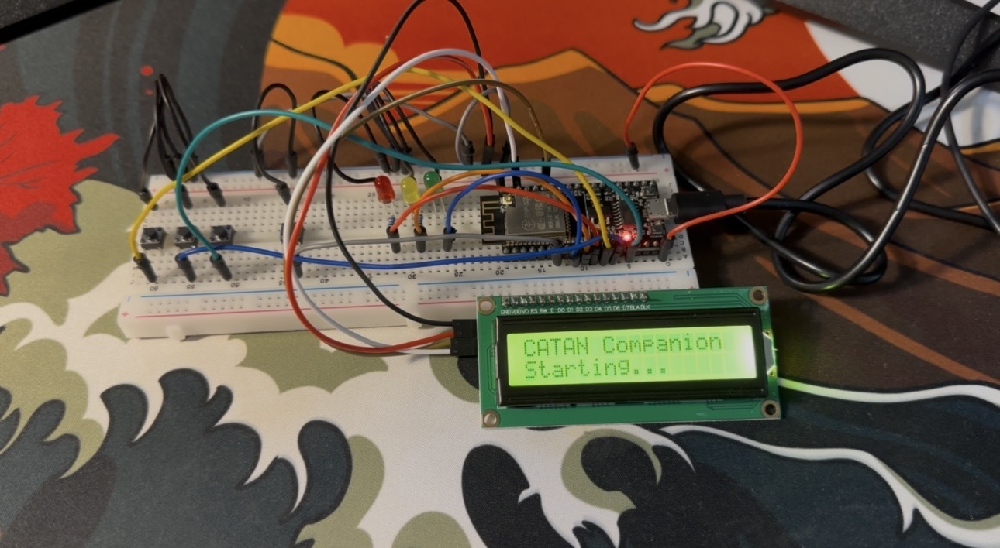

---

### Main — player count

*Setup: "Players: X" / "SEL chg MAIN nxt"*

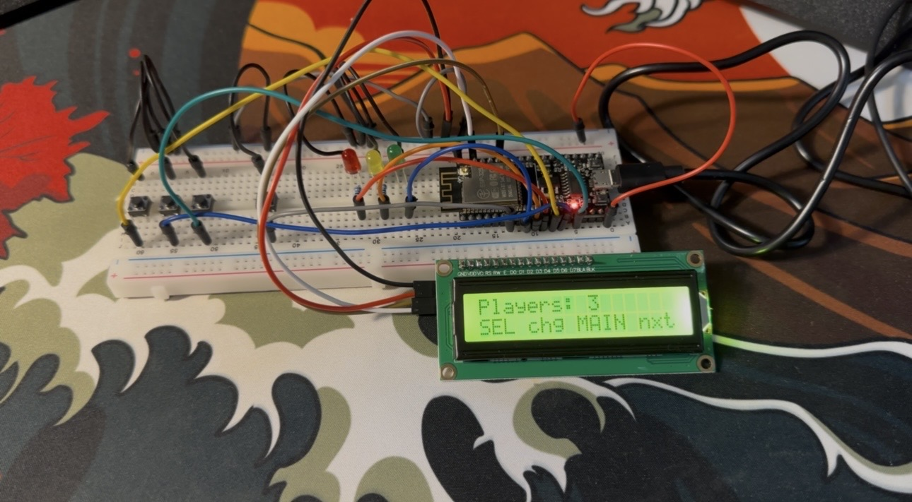
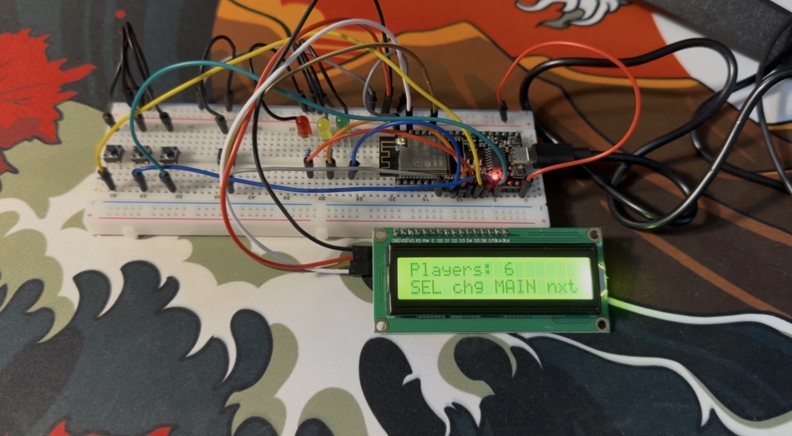

---

### Timer setup

*Setup: "Timer: XXs" / "SEL +15 MAIN go"*

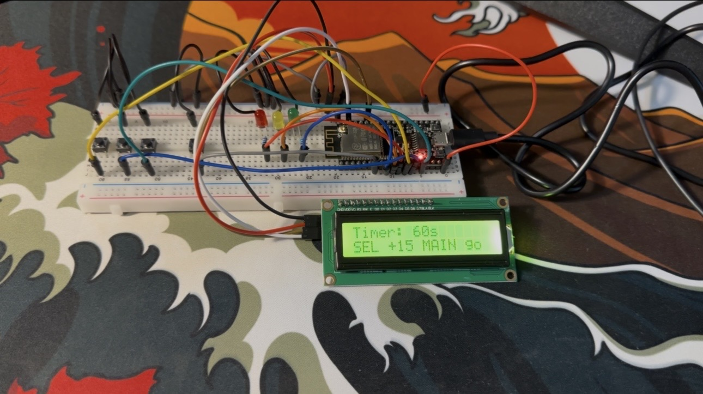
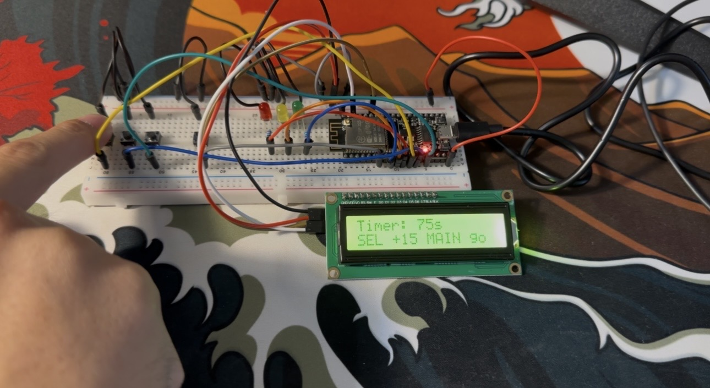
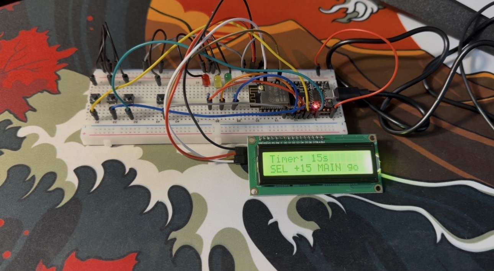

---

### Round N, Player N — wait for roll

*"R# P#: Roll" / "Press MAIN"*

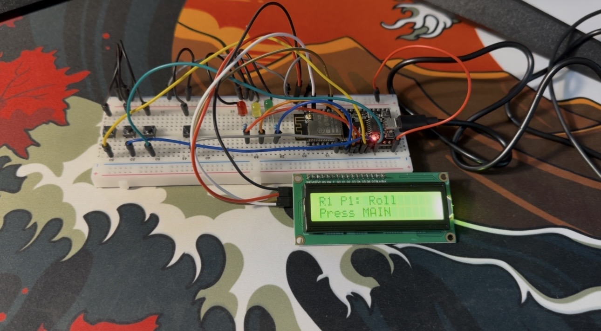

---

### Dice sequence

#### Rolling animation

*"Rolling dice..." with changing numbers*

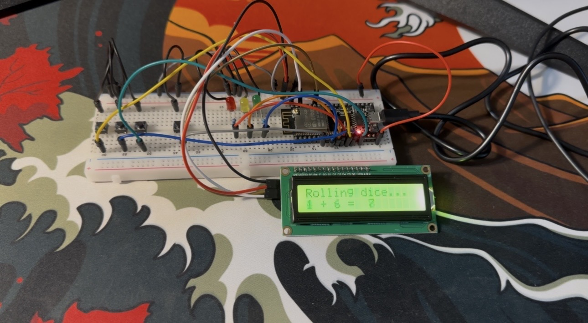

#### Result — dice total **7** (robber)

*Shows final dice, then robber flow — red LED*

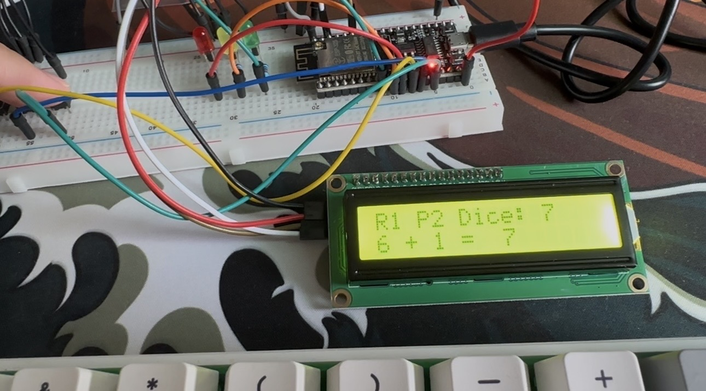

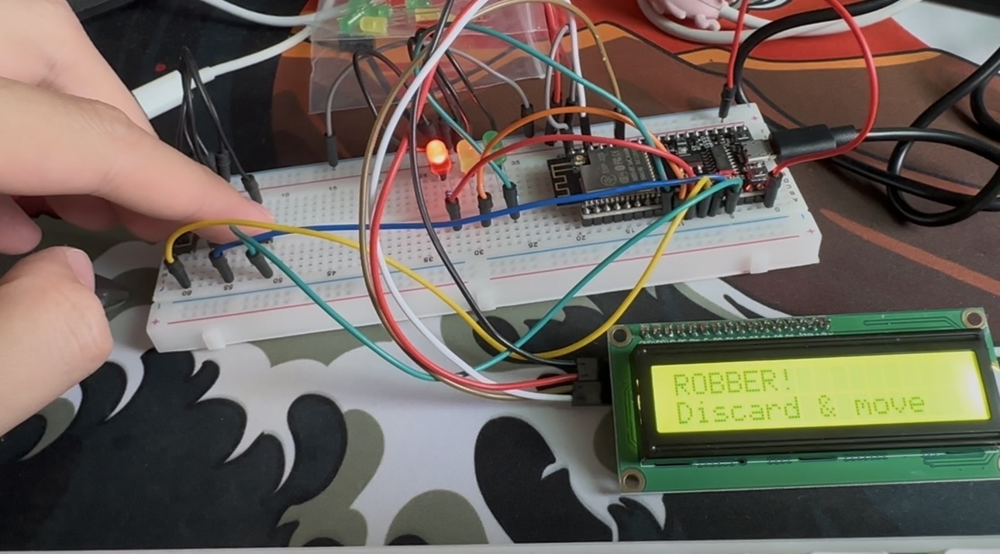

#### Result — dice total **not 7**

*Shows final dice, then resource path — green LED*

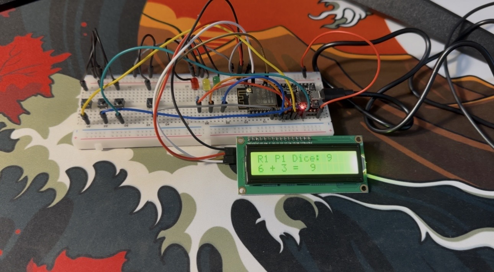

---

### Resource gather

*"Resources!" / "Gather: Xs" (8 second countdown)*

---

### Player turn timer

#### Normal countdown

*"R# P# Turn" / "Time: XXs" — green LED on*

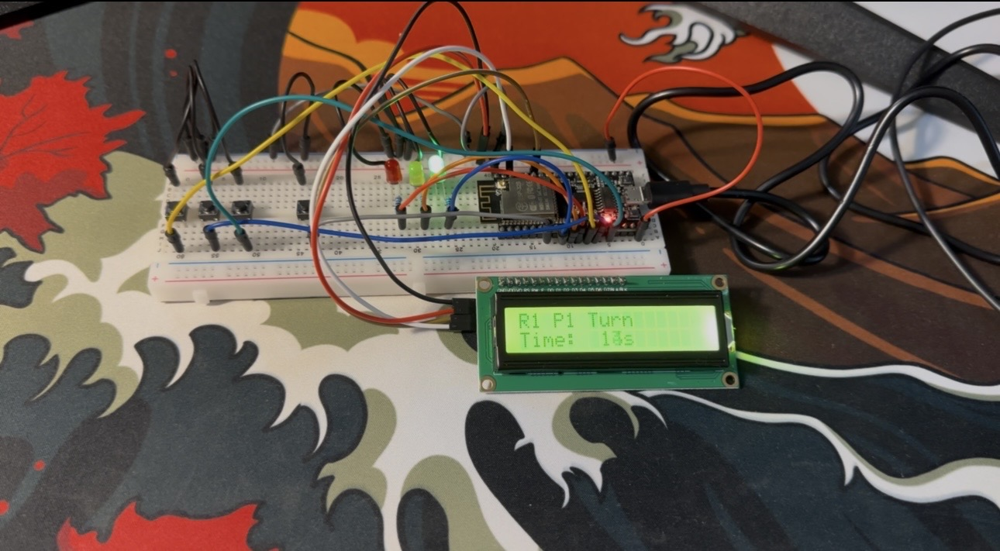

#### Low time warning

*≤10 s remaining — yellow LED flashing, warning beeps*

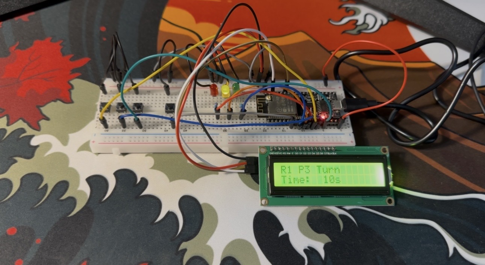

#### Time finished

*Timer hit ≤1 s — red LED, time-up alarm*

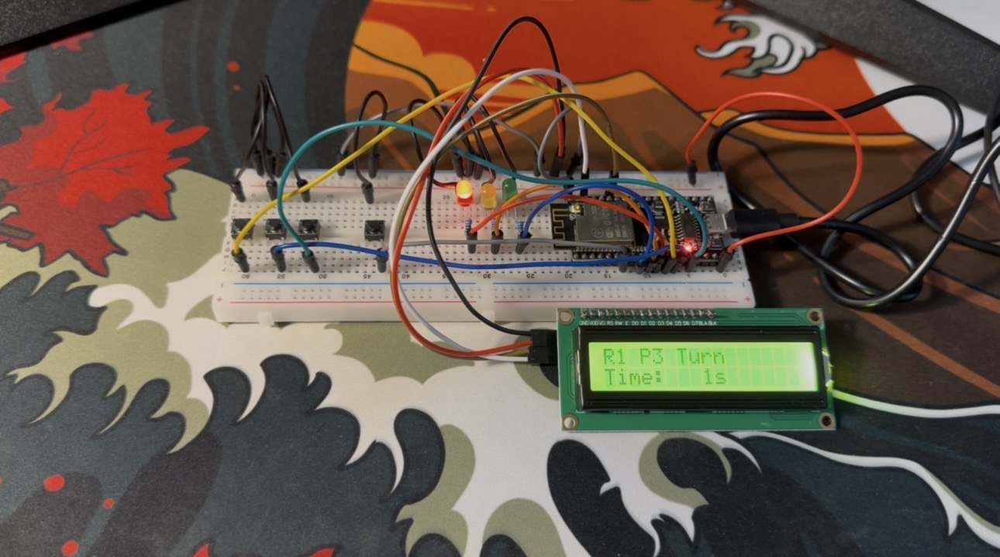

---
