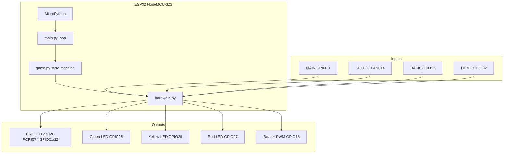
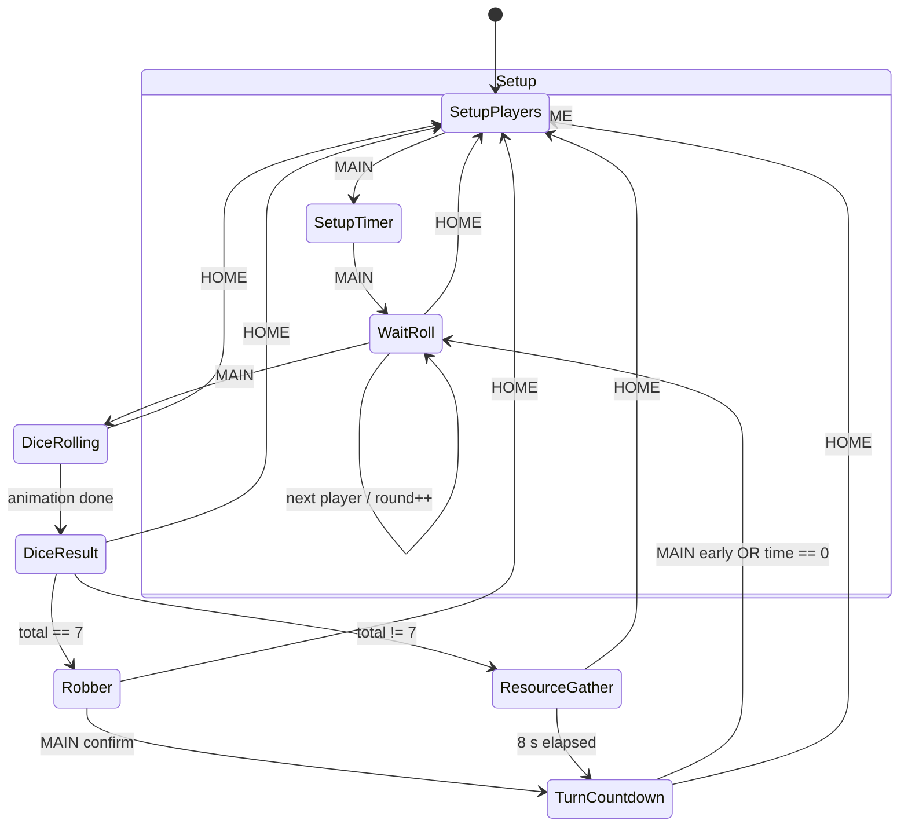
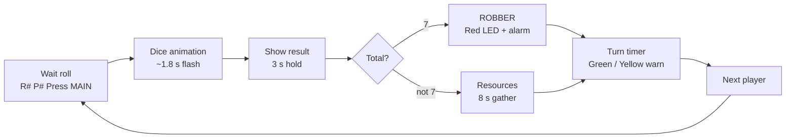
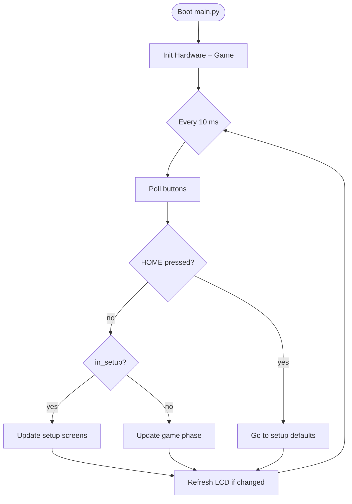
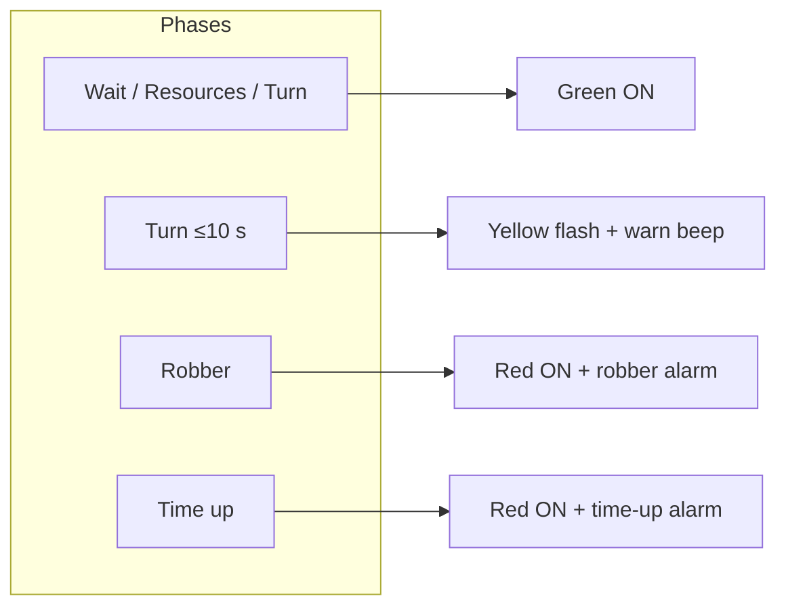

# Workflow & block diagrams

## System block diagram

High-level view of hardware and firmware layers.

---

## Game state machine

HOME can jump to **Setup (Players)** from any state (not drawn on every edge for clarity).

---

## Turn sequence (one player)

---

## Software loop (non-blocking)

---

## Phase timing summary

| Phase | Duration | Buttons active |
|-------|----------|----------------|
| Dice rolling | ~1.8 s | HOME only |
| Dice result | 3 s | HOME only |
| Robber | Until MAIN | MAIN, HOME |
| Resource gather | 8 s | HOME only |
| Turn countdown | Configured timer | MAIN, BACK, HOME |

---

## LED & buzzer mapping

Dice roll ticks use short buzzer pulses during animation only.
